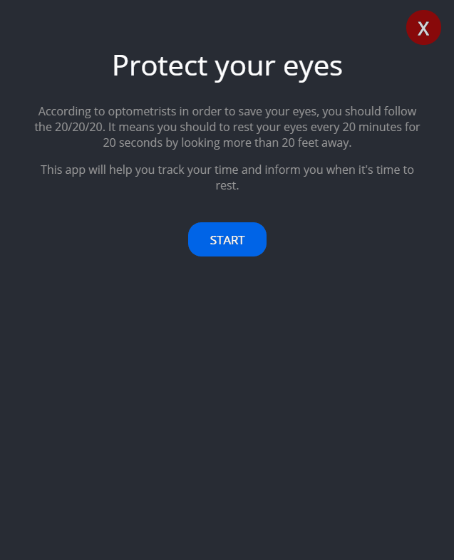
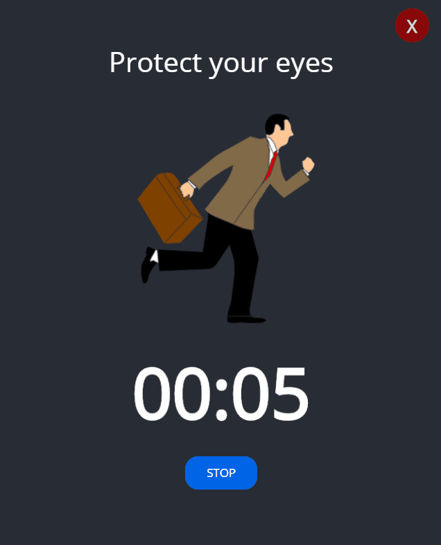

# SIMPLE DESKTOP APP

SIMPLE DESKTOP APP is application creating with React and Electron. It is a non-browser window application designed to protect eyes while using computer.

## How it works

## Getting Started
1. git clone git@github.com:Webster2020/BOOTSTRAP_WEBSITE.git
2. yarn install
3. yarn start - run the project and than You can see it on Your device

## Used technologies:
 1. React for content and logic
 2. CSS for styling
 3. Eletron to integrate Node.js with Webkit engine

## Project architecture

 1. components with JS, JSX
 2. styles in style.css
 3. main.js with Electron configuration
 4. .gitignore with instruction to ignore files during commiting and pushing to remote repository
 5. package.json with scripts and installed packages

## How did I create this project?

Project was created during the course.

## Authors

* **Michal Szwajgier** - *Webster2020* - 

## License
Free licence